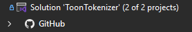
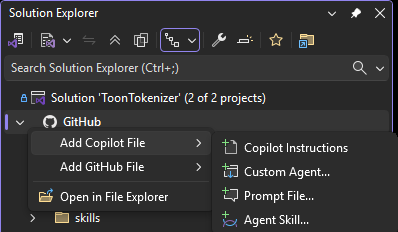
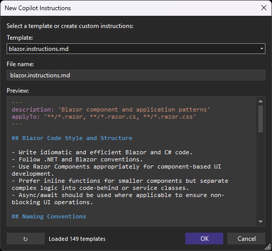

[marketplace]: https://marketplace.visualstudio.com/items?itemName=MadsKristensen.GitHubNode
[vsixgallery]: http://vsixgallery.com/extension/GitHubNode.9f81ec6e-5c91-4809-9dde-9b3166c327fd/
[repo]: https://github.com/madskristensen/GitHubNode

# GitHub Node for Visual Studio

Download this extension from the [Visual Studio Marketplace][marketplace]
or get the [CI build][vsixgallery].

----------------------------------------

Adds a **GitHub** node to Solution Explorer that displays the contents of your repository's `.github` folder. Quickly access and manage GitHub-specific files like workflows, Copilot instructions, agents, and more - all without leaving Visual Studio.

## Features

### GitHub Node in Solution Explorer

The extension adds a dedicated **GitHub** node directly under your solution, providing easy access to the `.github` folder contents:

- Automatically detects the `.github` folder in your repository
- Displays files and subfolders with appropriate icons
- Live updates when files are added, removed, or modified
- Double-click any file to open it in the editor

### Context Menu Commands

Right-click on the GitHub node or any subfolder to quickly create new files:

#### Copilot Customization
- **Add Copilot Instructions** - Create an instructions file (`.instructions.md`) in the `instructions` folder
- **Add Agent** - Create a custom Copilot agent (`.agent.md`) in the `agents` folder
- **Add Prompt** - Create a reusable prompt file (`.prompt.md`) in the `prompts` folder
- **Add Skill** - Create an agent skill folder with `skill.md` in the `skills` folder

#### GitHub Configuration
- **Add Workflow** - Create a new GitHub Actions workflow (`.yml`) in the `workflows` folder
- **Add Dependabot Config** - Create a `dependabot.yml` for automated dependency updates
- **Add Issue Template** - Create an issue template in the `ISSUE_TEMPLATE` folder
- **Add Pull Request Template** - Create a `PULL_REQUEST_TEMPLATE.md` file
- **Add CODEOWNERS** - Create a `CODEOWNERS` file for automatic reviewer assignment
- **Add FUNDING.yml** - Create a `FUNDING.yml` file for sponsor button configuration
- **Add SECURITY.md** - Create a `SECURITY.md` file for security policy documentation

#### Folder-Specific Commands
When you right-click on a specific folder (e.g., `agents`, `prompts`, `skills`, `instructions`, or `workflows`), the relevant "Add" command appears directly in the context menu for quick access.

#### File and Folder Management
- **Copy Path** - Copy the full path to the clipboard
- **Rename** - Rename files or folders directly from the context menu
- **Delete** - Delete files or folders with confirmation

#### Utilities
- **Open in File Explorer** - Open the folder in Windows File Explorer
- **Open Containing Folder** - Open the parent folder and select the file in File Explorer
- **Open on GitHub** - Open the file or folder directly on GitHub.com in your browser

### Git Status Icons

Files display Git status icons, similar to Solution Explorer:

- **Unchanged** - Files committed to the repository with no changes
- **Modified** - Files with local changes
- **Staged** - Files staged for commit
- **Added/Untracked** - New files not yet tracked by Git
- **Deleted** - Files marked for deletion
- **Conflict** - Files with merge conflicts
- **Renamed** - Files that have been renamed

### Community Templates from awesome-copilot

When creating Copilot agents, instructions, prompts, or skills, the dialog offers a curated collection of community templates sourced from the [awesome-copilot](https://github.com/github/awesome-copilot) repository.

Features:
- **Template dropdown** - Browse and select from community-contributed templates
- **Live preview** - See the template content with syntax highlighting before creating the file
- **Auto-fill filename** - Template names are automatically used as the filename
- **Refresh button** - Fetch the latest templates from GitHub
- **Caching** - Templates are cached locally for 7 days for fast access

The preview pane includes syntax highlighting for:
- Markdown headers and formatting
- YAML front matter (keys and values)
- Code blocks and inline code
- Links and URLs
- HTML comments

### File Templates

All created files come with helpful starter templates that follow best practices:

- **Copilot Instructions** - Sections for project overview, coding standards, architecture, and testing
- **Agents** - YAML frontmatter with name/description, plus sections for role, capabilities, and instructions
- **Prompts** - YAML frontmatter with mode and description, plus context and task sections
- **Skills** - YAML frontmatter with structured sections for purpose, instructions, and examples
- **Workflows** - Basic GitHub Actions workflow with common triggers and job structure
- **Issue Templates** - YAML frontmatter with description fields and standard issue sections
- **CODEOWNERS** - Comments explaining syntax with example patterns for teams
- **FUNDING.yml** - Configuration for GitHub Sponsors and other funding platforms
- **SECURITY.md** - Sections for supported versions, reporting vulnerabilities, and security updates

## Requirements

- Visual Studio 2022 (17.0 or later)
- A solution with a `.github` folder in the repository root

## How It Works

The extension uses Visual Studio's Solution Explorer extensibility to add an attached collection node. It monitors the `.github` folder using a `FileSystemWatcher` to keep the display in sync with the file system.

## Contribute

If you find this extension useful, please:

- [Rate it on the Marketplace][marketplace]
- [Report issues or request features][repo]
- [Sponsor development](https://github.com/sponsors/madskristensen)