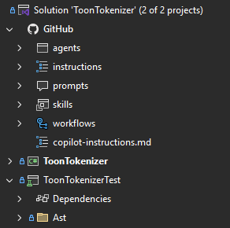

[marketplace]: https://marketplace.visualstudio.com/items?itemName=MadsKristensen.GitHubNode
[vsixgallery]: http://vsixgallery.com/extension/GitHubNode.9f81ec6e-5c91-4809-9dde-9b3166c327fd/
[repo]: https://github.com/madskristensen/GitHubNode

# GitHub Node for Visual Studio

Download this extension from the [Visual Studio Marketplace][marketplace]
or get the [CI build][vsixgallery].

----------------------------------------

Adds a **GitHub** node to Solution Explorer that displays the contents of your repository's `.github` folder. Quickly access and manage GitHub-specific files like workflows, Copilot instructions, agents, and more — all without leaving Visual Studio.

## Features

### GitHub Node in Solution Explorer

The extension adds a dedicated **GitHub** node directly under your solution, providing easy access to the `.github` folder contents:

- Automatically detects the `.github` folder in your repository
- Displays files and subfolders with appropriate icons
- Live updates when files are added, removed, or modified
- Double-click any file to open it in the editor

### Context Menu Commands

Right-click on the GitHub node or any subfolder to quickly create new files:

#### Copilot Customization
- **Add Copilot Instructions** — Create a `copilot-instructions.md` file with project-specific guidance for GitHub Copilot
- **Add Agent** — Create a custom Copilot agent (`.agent.md`) in the `Agents` folder
- **Add Prompt** — Create a reusable prompt file (`.prompt.md`) in the `Prompts` folder
- **Add Skill** — Create an agent skill folder with `skill.md` in the `Skills` folder

#### GitHub Configuration
- **Add Workflow** — Create a new GitHub Actions workflow (`.yml`) in the `Workflows` folder
- **Add Dependabot Config** — Create a `dependabot.yml` for automated dependency updates
- **Add Issue Template** — Create an issue template in the `ISSUE_TEMPLATE` folder
- **Add Pull Request Template** — Create a `PULL_REQUEST_TEMPLATE.md` file

#### Utilities
- **Open in File Explorer** — Open the folder location in Windows File Explorer

### File Templates

All created files come with helpful starter templates that follow best practices:

- **Copilot Instructions** — Sections for project overview, coding standards, architecture, and testing
- **Agents** — YAML frontmatter with name/description, plus sections for role, capabilities, and instructions
- **Prompts** — YAML frontmatter with mode and description, plus context and task sections
- **Skills** — YAML frontmatter with structured sections for purpose, instructions, and examples
- **Workflows** — Basic GitHub Actions workflow with common triggers and job structure
- **Issue Templates** — YAML frontmatter with description fields and standard issue sections

## Requirements

- Visual Studio 2022 (17.0 or later)
- A solution with a `.github` folder in the repository root

## How It Works

The extension uses Visual Studio's Solution Explorer extensibility to add an attached collection node. It monitors the `.github` folder using a `FileSystemWatcher` to keep the display in sync with the file system.

## Contribute

If you find this extension useful, please:

- ⭐ [Rate it on the Marketplace][marketplace]
- 🐛 [Report issues or request features][repo]
- 💝 [Sponsor development](https://github.com/sponsors/madskristensen)